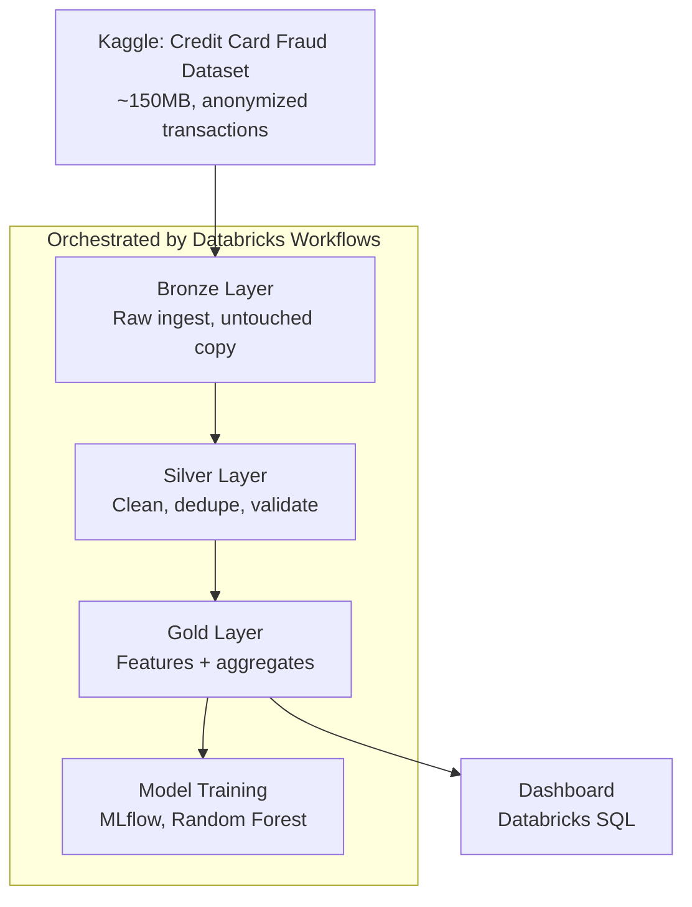
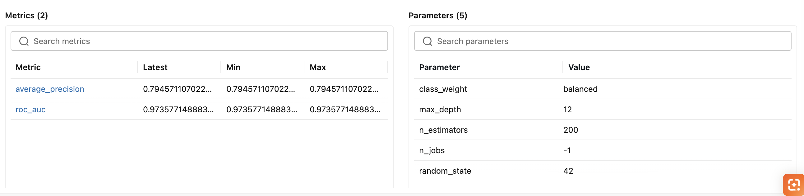
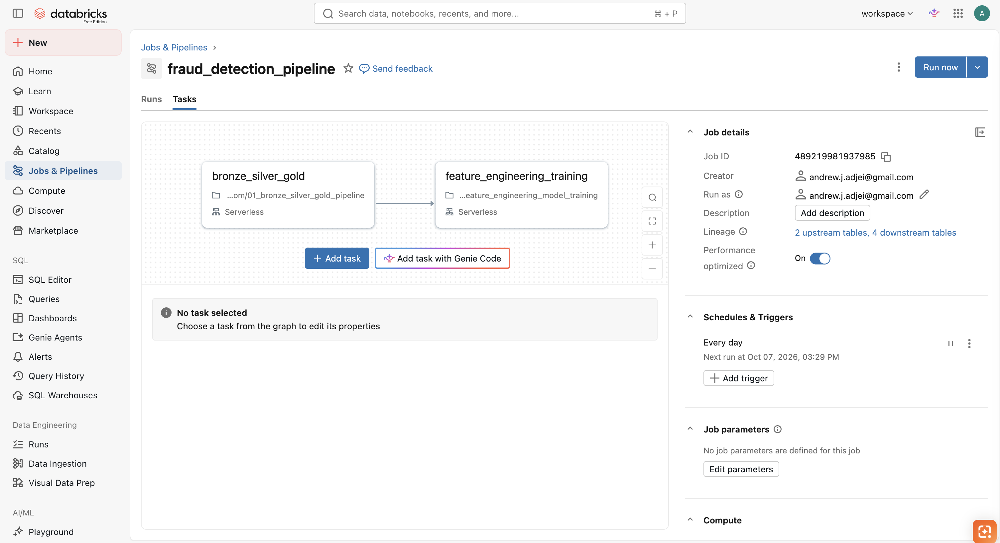

# Fraud Detection Pipeline - Databricks Medallion Architecture

An end-to-end data engineering pipeline that ingests credit card transaction data, processes it
through a Bronze → Silver → Gold medallion architecture, engineers features, and trains a fraud
classifier, all orchestrated as a scheduled Databricks Workflow with MLflow model tracking.

## Why this project

This project was built to demonstrate the full data engineering lifecycle on Databricks: not just a notebook that
runs once, but a pipeline with data quality checks, feature engineering, model tracking, and
production-style orchestration. The fraud detection use case ties directly into AML/SAR concepts
from banking compliance work.

## Architecture



## Tech stack

- **Databricks** (Free Edition) - compute, Unity Catalog, Workflows
- **PySpark** - ingestion and transformation
- **Delta Lake** - table format across all three layers
- **MLflow** - experiment tracking, model registry
- **scikit-learn** - baseline classifier (Random Forest)
- **Databricks SQL** - dashboarding

## Data

[Credit Card Fraud Detection dataset](https://www.kaggle.com/datasets/mlg-ulb/creditcardfraud)
(ULB / Kaggle) - 284,807 European card transactions over two days in September 2013, with 492
labelled as fraud (~0.17% fraud rate). Features `V1`-`V28` are PCA-anonymized; `Time` and `Amount`
are the only original, human-readable fields.

## Pipeline stages

### Bronze - raw ingestion
Loads the source CSV as-is into a Delta table, tagging each row with an ingestion timestamp and
source file path. No transformations - this is the untouched, reprocessable copy.

### Silver - clean and conform
Deduplicates, enforces types, runs null checks on key columns, and derives `transaction_hour`
from the raw `Time` field. Filters out any structurally invalid rows (e.g. negative amounts).

### Gold - business aggregations and features
Two tables:
- `gold_hourly_fraud_summary` - transaction count, fraud count, and fraud rate by hour, feeding
  the dashboard.
- `gold_model_features` - adds `amount_zscore` (a rolling z-score over the last 50 transactions,
  standing in for "does this look like normal spending behaviour") and `is_night` (flag for
  transactions between midnight and 5am).

**Finding worth noting:** the hourly rollup shows fraud rate isn't flat across the day — it spikes
to ~1.5% around 2am, roughly 9x the overall baseline of 0.17%. That pattern surfaced from the
aggregation alone, before any modelling.

### Model training
A Random Forest baseline (`class_weight="balanced"` to handle the severe imbalance), trained on
the Gold feature table and logged to MLflow with parameters, metrics, and a versioned, registered
model in Unity Catalog (`main.fraud_project.fraud_baseline_rf`).

**Results:**

| Metric | Value |
|---|---|
| ROC AUC | 0.9736 |
| Average precision | 0.7946 |
| Fraud recall | 0.72 |
| Fraud precision | 0.87 |

With a ~0.17% fraud rate, accuracy alone is meaningless (predicting "not fraud" every time would
still score >99.8%) - precision, recall, and average precision are the metrics that actually
matter here, and are what's reported above.



## Orchestration

Both notebooks run as a two-task Databricks Workflow (`fraud_detection_pipeline`), with
`feature_engineering_training` depending on `bronze_silver_gold` completing successfully.
Scheduled to run daily on Serverless compute. Databricks automatically tracks table lineage
across the run (2 upstream tables, 4 downstream tables).




## Repository structure

```
├── 01_bronze_silver_gold_pipeline.py       # Ingestion + medallion transformation
├── 02_feature_engineering_model_training.py # Feature engineering + MLflow training
├── screenshots/
│   ├── workflow_dag.png                    # Task graph from Databricks Jobs & Pipelines
│   └── mlflow_run.png                      # Registered model + metrics
└── README.md
```


